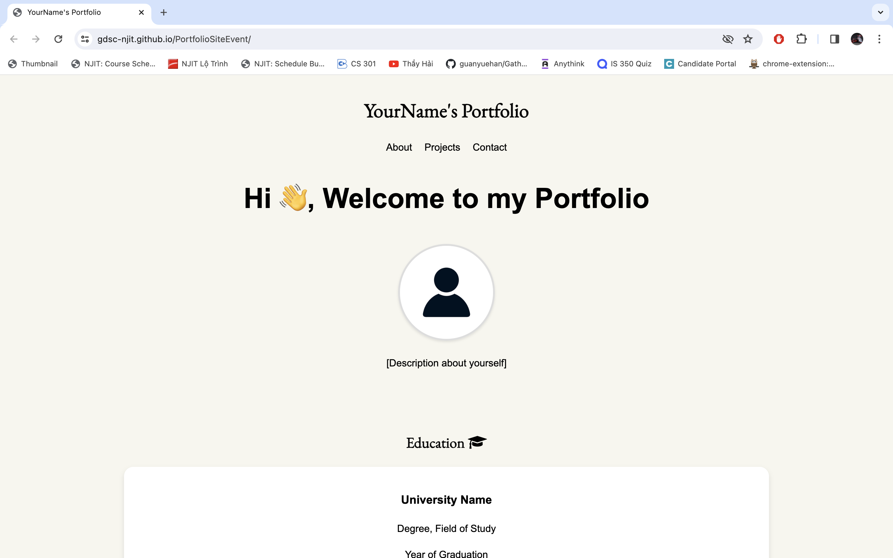
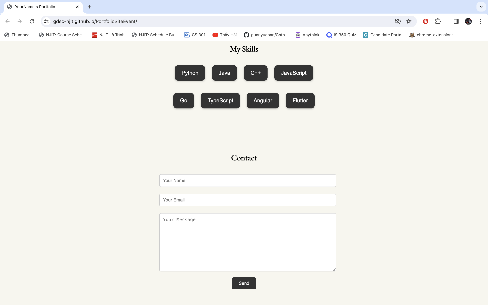

# Building Your Own Portfolio by [FinTech](https://www.instagram.com/njitfintech/), [HACCS](https://linktr.ee/njithaccs), and GDSC @ NJIT
> Build your Portfolio website using HTML/CSS, JavaScript, and especially Google Analytics

## Implementation

- Download ZIP or clone the repo on your terminal `git clone https://github.com/gdsc-njit/PortfolioSiteEvent.git`
- Open the repository on your IDE
- Run and view `index.html` on the browser
